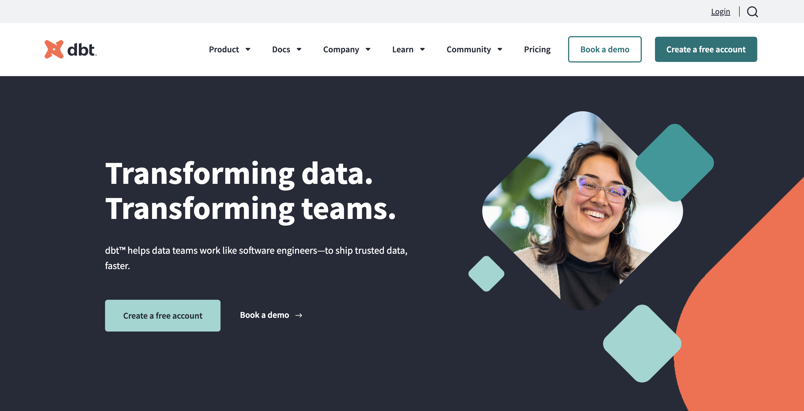
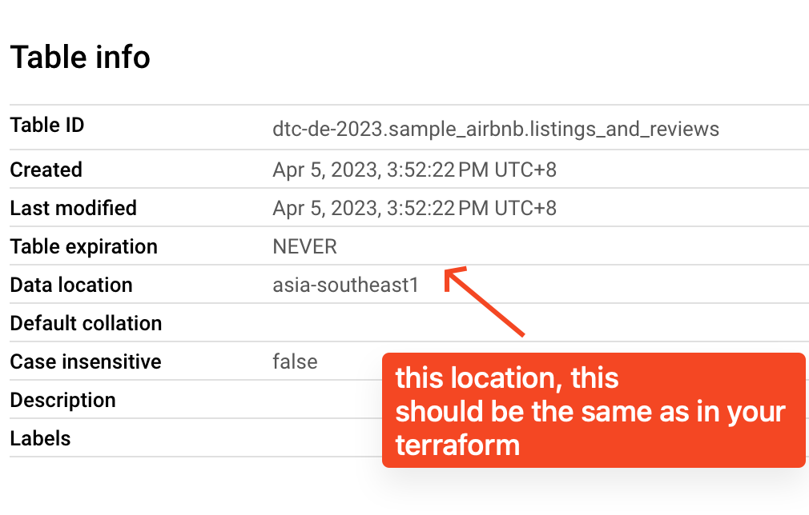

# Installation and Quick start Guide

### Prerequisites
1. Install with `pip`. https://docs.getdbt.com/docs/core/pip-install

### Initialized dbt
1. Using VS Code, on Explorer, right click on the folder you are working on, then, click `Open in Integrated Terminal`
2. Run `dbt init`
3. Follow the prompt
   > if your location is different than US or EU, you can change location later
   
   > Run `dbt debug --config-dir` to locate the profile.yml file. You can then update the location.

1. Run `dbt debug`, this check if you have the correct configs.
2. On metabase folder, copy and paste sql files to /models folder
3. Run `dbt run`. This will create a temporary view on your BQ datasets. This will also reflect on Metabase.
4. On Metabase, you can watch this [video](../../video/create_dashboard_metabase.mov) to save temporary views table then insert this to dashboard.
   

### Resources:
- Learn more about dbt [in the docs](https://docs.getdbt.com/docs/introduction)
- Check out [Discourse](https://discourse.getdbt.com/) for commonly asked questions and answers
- Join the [chat](https://community.getdbt.com/) on Slack for live discussions and support
- Find [dbt events](https://events.getdbt.com) near you
- Check out [the blog](https://blog.getdbt.com/) for the latest news on dbt's development and best practices
