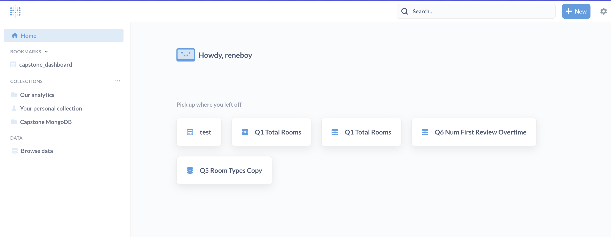

## Running Metabase on Docker
Metabase provides an official Docker image via Dockerhub that can be used for deployments on any system that is running Docker.

Source: https://www.metabase.com/docs/latest/installation-and-operation/running-metabase-on-docker

## Open Source quick start
Use this quick start to run the Open Source version of Metabase locally. See below for instructions on running Metabase in production.

Assuming you have Docker installed and running, get the latest Docker image:
`docker pull metabase/metabase:latest`

Then start the Metabase container:

`docker run -d -p 3000:3000 --name metabase metabase/metabase`

This will launch an Metabase server on port 3000 by default.

Optional: to view the logs as your Open Source Metabase initializes, run:

`docker logs -f metabase`

Once startup completes, you can access your Open Source Metabase at http://localhost:3000.

To run your Open Source Metabase on a different port, say port 12345:

`docker run -d -p 12345:3000 --name metabase metabase/metabase`

## Google BigQuery
Source: https://www.metabase.com/docs/latest/databases/connections/bigquery

To add a database connection, click on the gear icon in the top right, and navigate to Admin settings > Databases > Add a database.

## Prerequisites
You’ll need to have a Google Cloud Platform account with a project you would like to use in Metabase. Consult the Google Cloud Platform documentation for how to create and manage a project. This project should have a BigQuery dataset for Metabase to connect to.

## Google Cloud Platform: creating a service account and JSON file
You’ll first need a service account JSON file that Metabase can use to access your BigQuery dataset. Service accounts are intended for non-human users (such as applications like Metabase) to authenticate (who am I?) and authorize (what can I do?) their API calls.

To create the service account JSON file, follow Google’s documentation on setting up a service account for your BigQuery dataset. Here’s the basic flow:

    1. Create service account. From your Google Cloud Platform project console, open the main sidebar menu on the left, go to the IAM & Admin section, and select Service account. The console will list existing service accounts, if any. At the top of the screen, click on + CREATE SERVICE ACCOUNT.

    2. Fill out the service account details. Name the service account, and add a description (the service account ID will populate once you add a name). Then click the Create button.

    3. Grant the service account access to this project. You’ll need to add roles to the service account so that Metabase will have permission to view and run queries against your dataset. Make sure you add the following roles to the service account:
        > BigQuery Data Viewer
        > BigQuery Metadata Viewer
        > BigQuery Job User (distinct from BigQuery User)

> For more information on roles in BigQuery, see Google Cloud Platform’s documentation.

    1. Create key. Once you have assigned roles to the service account, click on the Create Key button, and select JSON for the key type. The JSON file will download to your computer.

# Creating Visualization using Metabase SQL Query
    1. On the Metabase Home page, click `New` on upper right portion.
    2. Click SQL Query
    3. Select a database, on my end its `Data Eng 2023`, your might be different.
    4. On the project folder (This is the submitted folder on github), got to metabase folder, open one the files, then, copy and paste it to the SQL editor of Metabase.
    5. Click Save, give it a name,
    6. Then press Run Query (this is the button on the lower right corner)

[Sample Video](../video/create_dashboard_metabase.mov)

# Another Option: Using Metabase Cloud.
    1. Connect via linkedin, so I can grant you temporary access.
       http://www.linkedin.com/in/eboygarcia