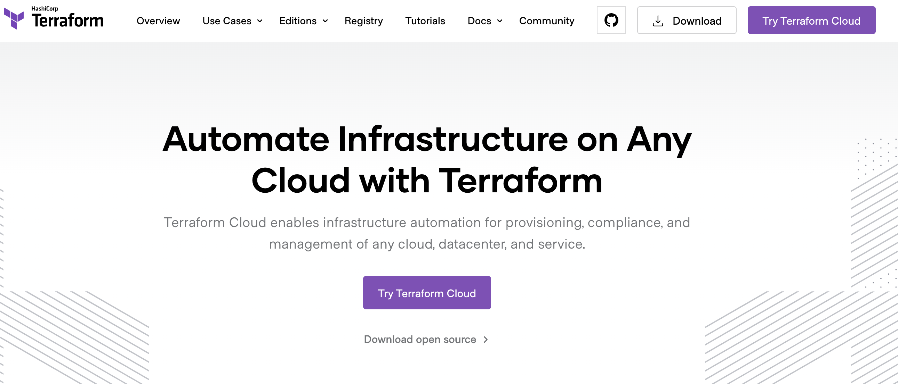
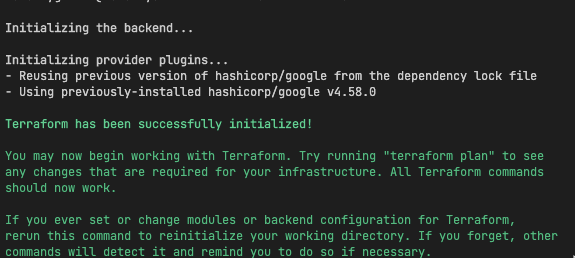
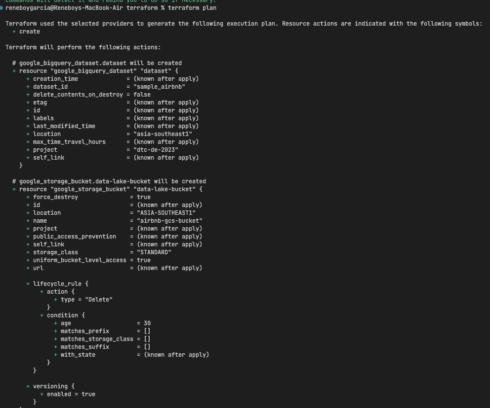
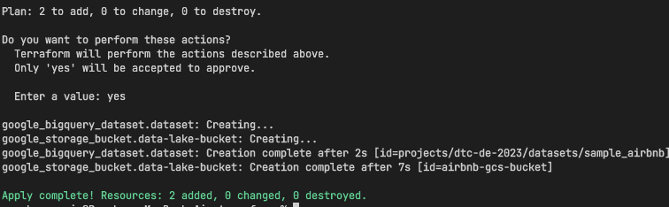

# Terraform Setup

## Prerequisites
1. Install gcloud CLI, https://cloud.google.com/sdk/docs/install
2. Install Terraform, https://developer.hashicorp.com/terraform/tutorials/gcp-get-started/install-cli

## Instructions
1. You can Refresh service-account's auth-token for this session
    - Run `gcloud auth application-default login`

2. Initialized terraform, On your folder, Open a terminal
   - Run `terraform init`
   

1. Check changes to new infra plan
   - Run `terraform plan`
  

1. Apply changes to infra plan, this will create the GCS Bucket and BQ dataset
    - Run `terraform apply`

1. Delete infra AFTER your work, to avoid costs on any running services
    - Run `terraform destroy`